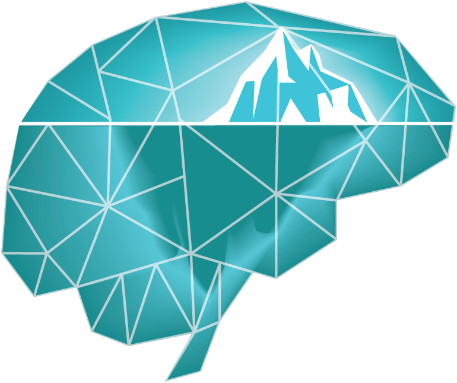

# ASRT_rapid_consolidation

Created by the <strong>MEMO Team</strong> of <strong>Lyon Neuroscience Research Center (CRNL)</strong>, Université Claude Bernard Lyon 1 (PI: Dezso Nemeth)

Experimental code for the rapid consolidation project. The implementation of the codes on the Gorilla Experiment Builder Platform can be found by <a href="https://app.gorilla.sc/openmaterials/397611">clicking here</a>.

<h2>Alternating Serial Reaction Time (ASRT) Task</h2>

Differences from the <a href="https://github.com/vekteo/ASRT_jsPsych">self-paced version</a>:

- 3 different groups as modified by the "group" variable:
1. <strong> Self-paced group </strong>: the participant can continue the task after the block feedback by pressing any button
2. <strong> Fifteen group </strong>: a 15000 ms break is inserted after the feedback, and the task continues automatically
2. <strong> Thirty group </strong>: a 30000 ms break is inserted after the feedback, and the task continues automatically
- The length of block feedback is 5000 ms, and no key press is needed to continue the task
- 2 practice blocks
- 25 ASRT blocks
- First 5 random is removed from the beginning of the block, thus, one block contains 80 stimuli (the first 2 is labeled as "X")
 
 <h2>N-back task</h2>

 More details <a href="https://github.com/vekteo/Nback_jsPsych">here</a>.
